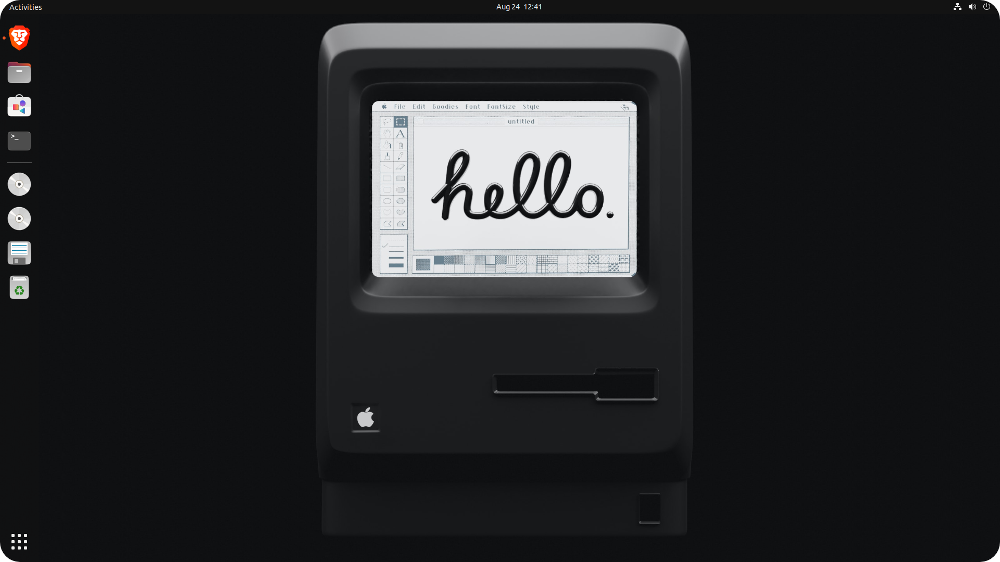
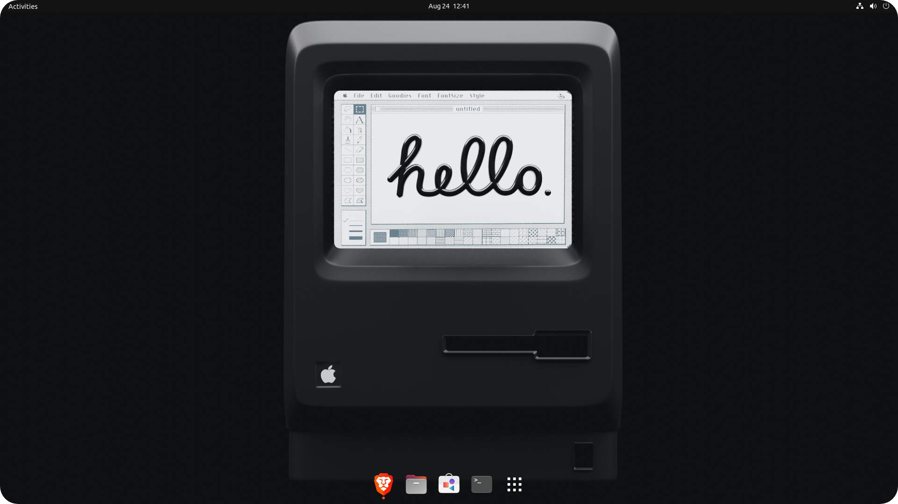

# 2Dock Script⚒️
A simple bash script to modify ubuntu dash to dock made with 💜 

&nbsp;

# Download

- Visit the github page [2Dock website](https://dreamcatcher45.github.io/2Dock/)
- Download the zip file
- Extract the zip file
- Open terminal in the current folder

&nbsp;
# Execute

- Run the install.sh file by the following command 
```
 ./install.sh
```
- Enter 1 for proceeding with installation.

- After succesfully execution Exit the terminal. 

&nbsp;
# Restore

- Run the install.sh file by the following command 
```
./install.sh
```
- Enter 0 for restoring to default settings.

- After succesfully execution Exit the terminal. 


&nbsp;
# Screenshots

&nbsp;

&nbsp;

# Contact

Email Id : jeromegeorge27@protonmail.com
